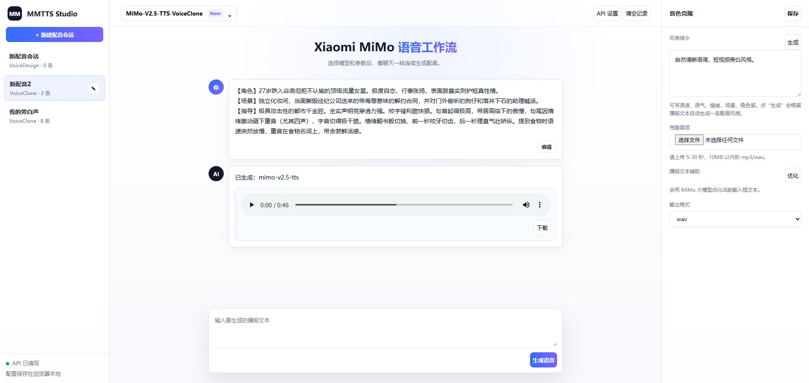

# MMTTS Studio

一个非官方的小米 MiMo TTS 本地网页客户端。

它可以使用你自己的小米 MiMo API Key，在本地浏览器里调用 MiMo 语音合成、音色设计和音色克隆能力。

## 截图



## 功能

- 支持 `mimo-v2.5-tts`
- 支持 `mimo-v2.5-tts-voicedesign`
- 支持 `mimo-v2.5-tts-voiceclone`
- 聊天式配音记录
- 支持上传参考音频做语音克隆
- 支持播放和下载生成音频
- 支持编辑历史文本并重新生成
- API Key 保存在浏览器本地
- 使用 `mimo-v2.5-pro` 辅助生成风格指令、音色描述和优化播报文本

## 安装

```bash
pip install -r requirements.txt
```

## 启动

```bash
python -m uvicorn server:app --host 127.0.0.1 --port 8300
```

然后打开：

```text
http://127.0.0.1:8300
```

Windows 也可以直接双击：

```text
start.bat
```

## API 设置

进入页面后，点击右上角 **API 设置**，填写：

```text
Base URL: https://token-plan-sgp.xiaomimimo.com/v1
API Key: 你的小米 MiMo API Key
```

## 使用说明

### 普通语音合成

选择：

```text
MiMo-V2.5-TTS
```

然后选择预置音色，输入播报文本，点击生成语音。

### 音色设计

选择：

```text
MiMo-V2.5-TTS-VoiceDesign
```

填写音色描述，比如：

```text
年轻女性，声音明亮自然，语气亲切，适合短视频口播。
```

然后输入播报文本并生成。

### 音色克隆

选择：

```text
MiMo-V2.5-TTS-VoiceClone
```

上传 5-30 秒、10MB 以内的 `mp3` 或 `wav` 参考音频，再输入播报文本生成。

## 注意事项

- 本项目不是小米官方项目。
- 请勿提交或公开你的 API Key。
- 只克隆你本人或已获得授权的声音。
- 生成音频默认保存在 `outputs/` 目录，该目录已被 Git 忽略。

## 免责声明

本项目仅用于学习和个人工作流辅助。使用 MiMo API 时，请遵守小米 MiMo 平台的相关服务条款和法律法规。
